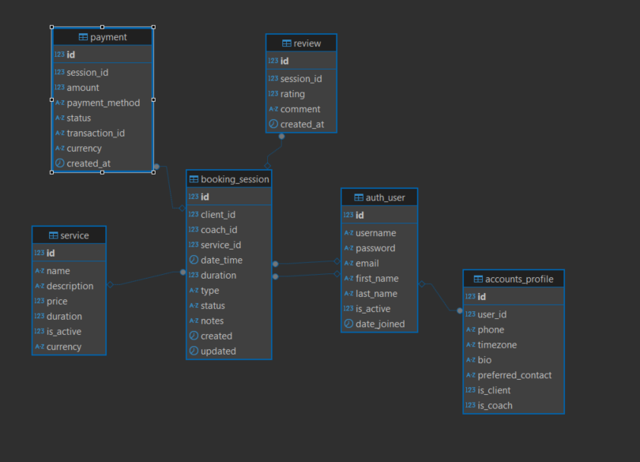

# Project LifeCoach reservation
A web application for coaching and psychological counseling.  

## Project Description
- [x] 1 Client account (`feature/client-account`)
  - [x] Registration (`feature/user-registration`)
    - [x] User registration form
    - [x] Basic authentication
  - [x] Profile Management
    - [x] Edit profile information
    - [x] Avatar upload
    - [x] Contact preferences
    - [x] Timezone settings
    - [x] Notification settings
  - [x] Session History
    - [x] View past sessions
    - [x] Session details
    - [x] Payment history

- [x] 2 Booking system (`feature/booking-system`)
  - [x] Ability to book appointments (US time, EU) 
    - [x] Time slot selection
    - [x] Service selection
  - [x] View available slots 
  - [x] Confirmation - coach
  - [x] Cancel or reschedule sessions 
    - [x] More than 24 hours in advance – allowed
    - [x] Less than 24 hours – admin only

- [x] 3 List of Services and Prices (`feature/services-prices`)
  - [x] Service model implementation
  - [x] Service catalog view
  - [x] Price list

- [x] 4 Payment integration (`feature/payment-integration`)
  - [x] PayPal 

- [x] 5 Session Feedback (`feature/session-feedback`)
  - [x] Rating system after completed session
  - [x] Optional written review/comments

- [x] 6 Reporting (`feature/reporting-analytics`)
  - [x] Booking reports
  - [x] Payment overviews

## Database Structure

### Entity Relationship Diagram


### Models
- [x] User/Client
  - [x] id (Integer, PK)
  - [x] username (varchar[150])
  - [x] password (varchar[128])
  - [x] email (varchar[254])
  - [x] first_name (varchar[150])
  - [x] last_name (varchar[150])
  - [x] is_active (bool)
  - [x] date_joined (datetime)

- [x] Profile
  - [x] id (Integer, PK)
  - [x] user_id (FK)
  - [x] phone (varchar[20])
  - [x] timezone (varchar[50])
  - [x] bio (text)
  - [x] preferred_contact (varchar[20])
  - [x] notifications_enabled (bool)
  - [x] avatar (ImageField)
  - [x] is_client (bool)
  - [x] is_coach (bool)

- [x] Session
  - [x] id (Integer, PK)
  - [x] client_id (FK)
  - [x] coach_id (FK)
  - [x] service_id (FK)
  - [x] date_time (datetime)
  - [x] duration (integer)
  - [x] type (enum: 'online', 'personal')
  - [x] status (enum: 'CANCELLED', 'CONFIRMED', 'CHANGED')
  - [x] notes (text)
  - [x] created (datetime)
  - [x] updated (datetime)

- [x] Service
  - [x] id (Integer, PK)
  - [x] name (varchar[100])
  - [x] description (text)
  - [x] price (decimal)
  - [x] duration (integer)
  - [x] is_active (bool)
  - [x] currency (varchar[3])

- [x] Payment
  - [x] id (Integer, PK)
  - [x] session_id (FK)
  - [x] amount (decimal)
  - [x] payment_method (enum: 'cash', 'paypal', 'Venmo')
  - [x] status (varchar[20])
  - [x] transaction_id (varchar[100])
  - [x] currency (varchar[3])
  - [x] created_at (datetime)

- [x] Review
  - [x] id (Integer, PK)
  - [x] session_id (FK)
  - [x] rating (integer, 1-5)
  - [x] comment (text)
  - [x] created_at (datetime)

## Completed Features

### Models and Database
- [x] Core Models
  - [x] Service (coaching services)
  - [x] Session (coaching sessions)
  - [x] SessionType (session types)
  - [x] SessionStatus (session statuses)
  - [x] Payment (payments)
  - [x] PaymentMethod (payment methods)
  - [x] Review (reviews)
- [x] Database Migrations
- [x] MySQL Configuration
- [x] MySQL Strict Mode

### Authentication and User Management
- [x] Crispy Forms Integration
- [x] Bootstrap 5 Integration
- [x] User Registration System
- [x] Profile Management
  - [x] Profile View and Edit
  - [x] Avatar Upload
  - [x] Contact Preferences
  - [x] Notification Settings
- [x] Coach/Client Role System

### UI/UX Improvements
- [x] Responsive Navigation Bar
- [x] Dark Green Color Scheme
- [x] Bootstrap-based Layout
- [x] Profile Card Design
- [x] Consistent Footer
- [x] Mobile-friendly Design

### Admin Interface
- [x] Enhanced Profile Management
- [x] User Role Management (Coach/Client)
- [x] Improved Admin Dashboard

## Git Workflow

### Branch Strategy
- `master` - Production-ready code, stable version of the application
- `develop` - Main development branch where features are integrated
- Feature branches: `feature/<feature-name>` - For developing new features
- Bug fix branches: `bugfix/<bug-name>` - For fixing bugs
- Release branches: `release/v<version>` - For preparing new releases
- Hotfix branches: `hotfix/<fix-name>` - For urgent production fixes

### Current Branches
- `master` - Main production branch
- `develop` - Development integration branch
- `feature/user-registration` - User registration implementation
- `feature/client-account` - Client account management
- `feature/database-structure` - Database models and migrations
- `feature/project-description` - Project documentation and setup


## Technologies

- Python 3.x
- Django 5.2
- MySQL

## Installation

1. Clone the repository:
```bash
git clone https://github.com/JudynkaS/LifeCoach.git
cd LifeCoach
```

2. Create a virtual environment:
```bash
python -m venv .venv
```

3. Activate the virtual environment:
- Windows:
```bash
.venv\Scripts\activate
```

4. Install dependencies:
```bash
pip install -r requirements.txt
```

5. Create a `.env` file with the following variables:
```
SECRET_KEY=your_secret_key
DB_PASSWORD=your_database_password
```

6. Run migrations:
```bash
python manage.py migrate
```

7. Start the development server:
```bash
python manage.py runserver
```

The application will be available at http://127.0.0.1:8000/

## Project Structure

```
LifeCoach/
├── LifeCoach/          # Main project configuration directory
│   ├── __init__.py
│   ├── settings.py     # Project settings
│   ├── urls.py         # Main URL configuration
│   ├── asgi.py         # ASGI configuration
│   └── wsgi.py         # WSGI configuration
├── accounts/           # Account management application
│   ├── migrations/     # Database migrations
│   ├── templates/      # HTML templates
│   ├── models.py       # Database models
│   ├── views.py        # View logic
│   ├── urls.py         # URL routing
│   └── admin.py        # Admin interface
├── viewer/             # Viewer application
│   ├── migrations/     # Database migrations
│   ├── templates/      # HTML templates
│   ├── models.py       # Database models
│   ├── views.py        # View logic
│   ├── urls.py         # URL routing
│   └── admin.py        # Admin interface
├── static/             # Static files (CSS, JS, images)
├── templates/          # Global templates
├── fixtures/           # Initial data fixtures
├── files/             # Project files and documentation
├── manage.py          # Django project manager
├── requirements.txt   # Dependencies list
├── .gitignore        # Git ignore rules
└── README.md         # Project documentation
```

## Development Setup

### Prerequisites
- Python 3.11.2
- MySQL Database
- Git

## Testing

### Running Tests
```bash
python manage.py test registration.test_views
```

### Test Coverage
```bash
coverage run --omit="*/tests/*" -m pytest
coverage html
```